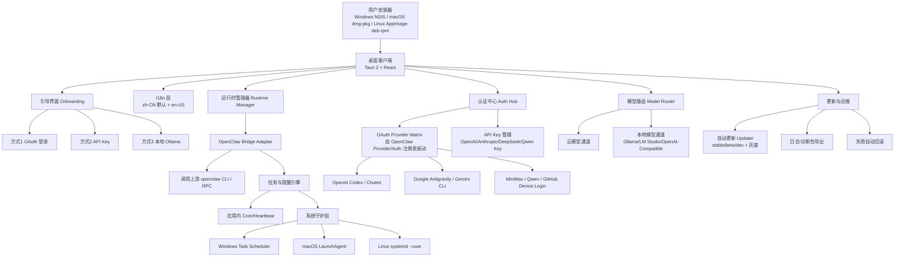

# openclaw-desktop 架构图（V1）

更新时间：2026-02-18

## 架构目标
- 一键安装，一次登录即可使用。
- 兼容主流 Windows、macOS、Linux 用户环境。
- 同时支持三种模型接入方式：OAuth（免 Key，覆盖 OpenClaw 全部可用 OAuth）、本地模型、API Key。
- 支持高频在线升级（OTA）与失败回滚。
- 默认中文 UI，可切换英文 UI。

## 总体架构图

## 关键设计说明
- 不强制 WSL：Windows 走原生后台守护（Task Scheduler）与原生打包安装。
- 优先小包体：桌面壳采用 Tauri，减少安装包体积与冷启动成本。
- OAuth 优先：默认引导 OAuth 模式，并展示 OpenClaw 当前全部可用 OAuth 提供商。
- 本地模型内建：默认提供本地模型入口与连通性检测，降低新手配置难度。
- 统一控制面板：登录、模型选择、渠道绑定、任务提醒均在同一 UI 内完成。
- 引导界面固定三种使用方式：OAuth、API Key、本地 Ollama，并支持后续自由切换。
- OAuth Provider 动态化：OAuth 列表从 OpenClaw 上游注册表/插件系统读取，避免“只支持单一提供商”的文档或实现偏差。
- 上游最小侵入：业务逻辑放在 `openclaw-desktop/`，通过 Bridge Adapter 对接 `openclaw/`，避免长期维护 Fork。
